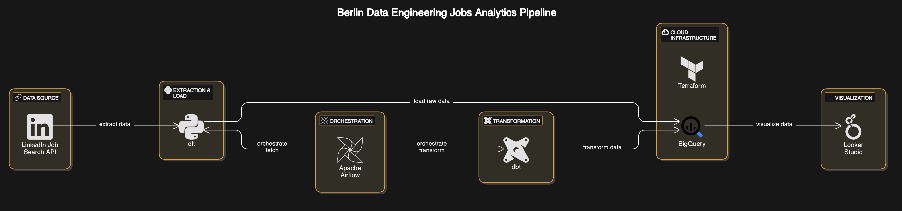

# Berlin Data Engineering Jobs Analytics

This repository contains a data engineering project focused on extracting, transforming, and analyzing job postings for Data Engineering roles in **Berlin**. The goal is to uncover insights about hiring trends, company demand, industry breakdowns, and commonly required skills using a modern data stack deployed on **Google Cloud Platform (GCP)**.

---

## 📌 Project Objectives

The project aims to answer the following questions:

1. **How many job postings related to Data Engineering were made in the last X days?**  
   - What is the **Month-over-Month (MoM)** percentage change in volume?

2. **How many different companies** have job openings for Data Engineering roles?

3. **Which industries** are hiring Data Engineers the most?

4. **What are the most in-demand skills or tech stacks** based on job descriptions?

---

## 🧩 Project Architecture



The pipeline involves API data extraction, cloud data storage, transformations using dbt, and orchestration with Apache Airflow.

---

## 🔄 ETL Process Overview

### 🔍 Data Source

- **Source**: [LinkedIn Job Search API](https://rapidapi.com/)
- **Access via**: RapidAPI (Free Tier: 15 requests/month, ~500 jobs)
- **Extracted using**: [`dlt`](https://github.com/dlt-hub/dlt) — an open-source Python library built for scalable API ingestion

### ☁️ Cloud Setup (Terraform)

- **Provider**: Google Cloud Platform (GCP)
- **Provisioned via Terraform:**
  - BigQuery datasets:
    - `raw_data`: for unprocessed API data
    - `transformed_data`: for transformed insights
  - Cloud Storage bucket *(created but not used in current implementation)*

---

## 🛠️ dbt Transformation

Data transformation is handled using `dbt` with the following model structure:

- **Staging Layer**: Cleans and normalizes raw API data
- **Intermediate Layer**: Refines data further for analysis
- **Core Layer**: Final analytics models used to answer key business questions

### 🧪 dbt Tests

- Built-in generic tests:
  - Check for duplicates
  - Null value validation
  - Source freshness check for job postings

---

## 🎯 Workflow Orchestration (Airflow)

An Airflow DAG coordinates the pipeline with the following tasks:

1. `fetch_and_upload_data`: Extract and load raw data to BigQuery
2. `dbt_run`: Run dbt transformations
3. `dbt_test`: Execute data quality tests on the models

---

## 📊 Dashboard

A **Looker Studio Dashboard** visualizes insights from the transformed data.  
🔗 [View the Dashboard](https://lookerstudio.google.com/reporting/05e19323-d5db-494c-ad7d-528cbda1ff4f)

---

## 🧰 Tech Stack

| Layer              | Tool/Service                    |
|--------------------|---------------------------------|
| Extraction         | Python, `dlt`                   |
| Cloud Infrastructure | GCP (Terraform)              |
| Storage            | BigQuery                       |
| Transformation     | dbt                            |
| Orchestration      | Apache Airflow                 |
| Visualization      | Looker Studio                  |

---

## 📦 Repository Structure

```
Berlin-Data-Engineering-Jobs-Analytics/
├── .dlt/                         # DLT configuration and secrets
│   └── secrets.toml              # Your API and BigQuery credentials
├── airflow/
│   └── dags/                     # Airflow DAG definitions
│       └── bigquery_dbt_pipeline.py
├── dbt_project/                  # dbt project files
│   └── berlin_data_engg_job_analytics/
├── pipeline/                     # Python scripts for extraction and loading
│   └── run_extract_load_job.py
├── terraform/                    # Terraform configuration (optional)
│   ├── main.tf
│   ├── variables.tf
│   └── credentials/
│       └── service-account.json  # Your GCP service account key
├── Dockerfile                    # Docker image definition
├── docker-compose.yml            # Service configuration
└── requirements.txt              # Python dependencies
```

---
## ⚙️ Setup Guide

### ✅ Prerequisites

- **GCP** project with:
  - BigQuery enabled
  - A service account (with BigQuery Admin role)
  - Service account key (JSON)
- **API Key** from [RapidAPI](https://rapidapi.com/fantastic-jobs-fantastic-jobs-default/api/linkedin-job-search-api)

---

### 📦 1. Clone the Repository

```bash
git clone https://github.com/Joyan9/Berlin-Data-Engineering-Jobs-Analytics.git
cd Berlin-Data-Engineering-Jobs-Analytics
```

---

### 📦 2. Install Python Dependencies

```bash
pip install -r requirements.txt
```

---

### ⚙️ 3. Configure Environment Variables

Set these environment variables:

```bash
export AIRFLOW_HOME=/path/to/Berlin-Data-Engineering-Jobs-Analytics/airflow
export PROJECT_ROOT=/path/to/Berlin-Data-Engineering-Jobs-Analytics
export DBT_PROJECT_PATH=/path/to/Berlin-Data-Engineering-Jobs-Analytics/dbt_project/berlin_data_engg_job_analytics
export GOOGLE_APPLICATION_CREDENTIALS=/path/to/service-account.json
export LINKEDIN_JOBS_API_KEY="your-api-key"
export BIGQUERY_RAW_DATASET=raw_data
export BIGQUERY_LOCATION=europe-west10
export BIGQUERY_PROJECT_ID=your-project-id
```

---

### 🏗 4. Create GCP Resources

Provision resources using Terraform **or** manually create two BigQuery datasets:

- `raw_data`
- `transformed_data`

---

### 🛠 5. Configure dbt Profile

Create the following `~/.dbt/profiles.yml`:

```yaml
berlin_data_engg_job_analytics:
  outputs:
    dev:
      type: bigquery
      method: service-account
      keyfile: /absolute/path/to/service-account.json
      project: your-project-id
      dataset: transformed_data
      location: europe-west10
      threads: 2
      priority: interactive
      job_retries: 1
      job_execution_timeout_seconds: 300
  target: dev
```

Test connection:

```bash
source ./venv/bin/activate
cd $DBT_PROJECT_PATH
dbt debug
```

---

### ⏱ 6. Start Airflow and Trigger DAG

From the project root:

```bash
source ./venv/bin/activate
airflow webserver
airflow scheduler
```

Access the Airflow UI at [http://localhost:8080](http://localhost:8080)  
Enable and manually trigger the `bigquery_dbt_pipeline` DAG.

Check your BigQuery datasets for populated data.

---

## 👤 Author

**Joyan Bhathena**  
🔗 [LinkedIn](https://www.linkedin.com/in/joyanbhathena)
